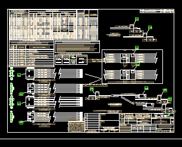
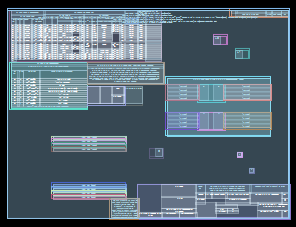
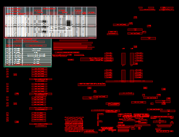

# Cad Extract

Extract Tabular Data from Cad Drawing Files

## Features

- [x] Import .dxf files
- [ ] Import .pdf files
- [x] Preview Imported Files
- [x] Extract tables from cad drawings
    - [x] Identify Table Cells
    - [x] Locate Text within a Table Cell
    - [x] Identify Merged Cells
    - [x] Identify Tables (not touching)
    - [x] Partition Separate Tables (even if touching)
    - [x] Identify Data Rows
    - [ ] Identify Column Names
    - [x] Handle 3 Sided Boxes (one side not closed)
- [ ] Table Data Extraction
    - [x] Table Patterns
    - [x] Sample Table Patterns
    - [x] Preview Table Pattern Data (In Situ)
    - [ ] Table Pattern Editor
    - [ ] Table Pattern Discovery (from scanning multiple drawings)
    - [x] Handle Merged Row Cells
- [x] Preview Extracted Tables
- [x] Preview Extracted Tables (in Situ)
- [x] Copy to Clipboard in Excel Format (Html Format)
- [ ] ExtractionDataView Wpf Control
    - [ ] Show Default (Final) View
    - [ ] Optionally show debug views
    - [ ] Display Focused Table Data in DataGrid at Bottom of view (for Final view)
- [ ] Error Detection
    - [ ] Add Unmatched Text for TableData Rows (for any row text in table which did not match the table pattern)
    - [ ] 
- [ ] Generate a .csv file (without merged cells)
- [ ] Generate a .xlsx file (with merged cells)
- [ ] Transform extracted rows into a .json file (converting column values into object fields)
- [ ] Verify Extraction Accuracy with Visual Round Trip Automatic Comparison
    - (Requires a pdf version of the source document even if extraction is from dxf)
    - Extract the tables
    - Recreate a pdf from the extracted data (only table lines and text)
    - (Optional) Visually compare any differences (missing text, misplaced text, etc.)

## Bugs

- [x] Cell Column and Row should work for multiple neighbor connections
- [ ] Top Header Cell does not get full column span
- [x] Handle Duplicate Rows because of split cells with markthrough line
- [ ] Handle Strikethrough Text
- [x] TableDataView Columns Fields moving to left incorrectly
- [ ] Handle Merged Rows and Columns in Table Pattern Extraction (Right now it duplicates values, with no indication of merged data)

## Screen Shots

## License

MIT